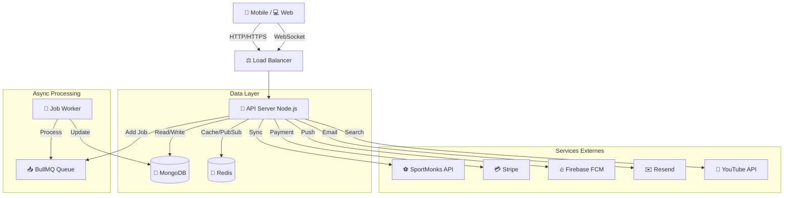

# 🏗️ Architecture Technique - FootballHub+

Ce document décrit l'architecture technique de la plateforme FootballHub+, mise à jour en Février 2026.

## 🌟 Vue d'ensemble

FootballHub+ est une plateforme SaaS complète pour le football, combinant des fonctionnalités temps réel, e-commerce, billetterie et gestion de contenu.

### Stack Technologique (MERN Modernisé)

| Couche | Technologie | Rôle |
|--------|-------------|------|
| **Frontend** | **Next.js 15 (React)** | Interface utilisateur, SEO, Server Components |
| **Mobile** | **Capacitor** | Applications natives Android & iOS |
| **Backend** | **Node.js / Express** | API REST, Logique métier |
| **Temps Réel**| **Socket.io + Redis** | Scores en direct, Chat, Notifications instantanées |
| **Database** | **MongoDB** | Stockage principal (Users, News, Matches, Orders) |
| **Cache** | **Redis** | Mise en cache API, Sessions, Pub/Sub |
| **Async Jobs**| **BullMQ** | Gestion des files d'attente (Sync news, Emails) |
| **Monitoring**| **Prometheus + Sentry**| Métriques de performance et tracking d'erreurs |

---

## 📐 Diagramme d'Architecture

---

## 🛠️ Modules Principaux

### 1. API Backend (`/backend`)
L'API est structurée en couches pour une meilleure maintenabilité :
- **Routes** : Points d'entrée HTTP sécurisés.
- **Controllers/Services** : Logique métier (ex: `newsService.js`, `websocketService.js`).
- **Models** : Schémas de données Mongoose.
- **Queues** : Traitement asynchrone (ex: synchronisation des news).

**Nouveautés (Février 2026) :**
- **Socket.io avec Redis Adapter** : Permet de scaler horizontalement (plusieurs serveurs API peuvent communiquer entre eux).
- **BullMQ** : Remplace les simples CRON jobs par des files d'attente robustes avec retries automatiques.
- **Monitoring** : Endpoint `/metrics` pour Prometheus et intégration Sentry.

### 2. Frontend Web (`/web`)
Application Next.js 15 utilisant l'App Router.
- **Server Components** pour le SEO et la performance initiale.
- **Client Components** (`'use client'`) pour l'interactivité (ex: `CommentsSection`, `LiveScore`).
- **Tailwind CSS** pour le styling "Premium" (Dark Mode natif).
- **Zustand** pour la gestion d'état global (Auth, Panier).

### 3. Mobile (Capacitor)
Le dossier `/web` est transpilé en applications natives.
- Utilise les plugins Capacitor pour l'accès matériel (Caméra pour QR Scan, Push Notifications, Haptics).

---

## 🔄 Flux de Données Clés

### A. Synchronisation des News
1. Le **CRON** (toutes les 30 min) ajoute un job dans la file **BullMQ** `news-sync`.
2. Le **Worker** prend le job, appelle l'API **SportMonks**.
3. Les nouvelles sont filtrées et sauvegardées dans **MongoDB**.
4. Si "Breaking News", une notification **Firebase** est envoyée aux mobiles.

### B. Live Scores
1. Le serveur récupère les scores toutes les 10s (ou via webhook).
2. Les données sont publiées dans le canal **Redis** `live-matches`.
3. **Socket.io** diffuse l'événement aux clients connectés au namespace `/livescores`.

---

## 🚀 Déploiement & Skalabilité

L'application est "Cloud Native" ready.
- **Docker** : Chaque service peut être conteneurisé.
- **Stateless** : L'API ne garde pas d'état local (tout est dans Redis/Mongo), ce qui permet de lancer 10 instances de l'API en parallèle sans problème.

## 🛡️ Sécurité
- **Helmet** : Protection headers HTTP.
- **Rate Limiting** : Protection contre DDoS et Brute Force.
- **JWT** : Authentification sécurisée stateless.
- **CORS** : Strict whitelist des origines autorisées.
